# 0. デモ動画
[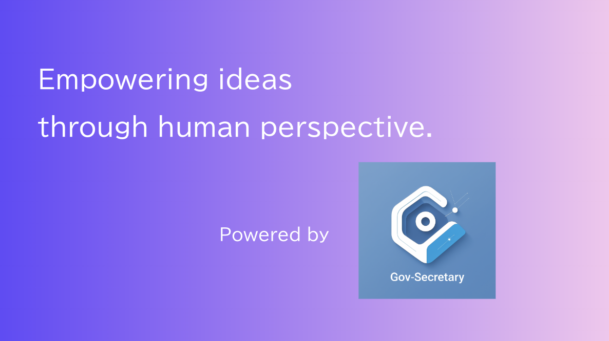](https://www.canva.com/design/DAG9-85u2M4/ufNpSprwiFPt8S3pffvfyQ/watch?utm_content=DAG9-85u2M4&utm_campaign=designshare&utm_medium=link2&utm_source=uniquelinks&utlId=haf78e1dd05)
<br><br>

# 1. 背景・課題
皆さんはお住まいの地域で家を建てる際にどのような助成金がもらえるかご存じでしょうか？
もしくは、出産にあたり無痛分娩の助成金が提供されているかご存じでしょうか？
利用経験がある方はご存じかもしれませんが、多くの方は必要になったときに初めて検索し、制度の存在を知ることになるのではないでしょうか。

これらの制度の多くは税金で賄われ、より多くの人々の暮らしを豊かにするために各自治体や国から提供されています。
必要としている人たちに各制度を認知・利用いただくため、各自治体も広報やわかりやすいホームページの構築、自治体窓口での情報提供を行っているものの、依然として必要な制度情報を素早く的確に取得・理解するのは困難です。
この課題の原因として、以下のような点が挙げられます。
- 制度自体の存在を認知しておらず、検索等で辿り着くことが困難
- 制度が多いうえに提供元も国や自治体、各省庁等に分散しており、情報の取得が困難
- 制度や適用条件、利用手順が複雑であり、検討や理解に時間を要する

この「知らない」「見つからない」「わからない」が原因で制度と利用者の間にミスマッチが起き、双方に大きな機会損失が生じています。

今回開発した行政秘書は、ユーザ情報に基づき必要になりうる制度や届出、助成情報を提示するサービスです。
ひとりひとりに合った制度情報を網羅的に検索することで、(1) 知らなかった制度等の発見、(2) 必要な制度の一元表示、(3) 申請に必要な情報・手順の整理と提示を行い、「知らない」「見つからない」「わからない」を解消することを目指します。

# 2. "行政秘書 / Gov-Secretary"とは
行政秘書は、**ユーザのプロファイル (自治体・世帯構成・収入の目安、直近のライフイベント等) をもとに、関連しうる公共支援制度を検索し、内容の理解から申請手順までを一気通貫で案内するAIエージェントサービス**です。
ユーザは必要な情報を入力するか質問に答えるだけで、ユーザが利用できる制度の候補をまとめて取得することができます。
単に制度一覧を表示するだけでなく、制度の説明、手続きの流れ、参照元等の必要なポイントを整理して提示し、申請に向けたアクションに進みやすい設計としています。
行政秘書を利用することで何度も検索ワードを変えたり複数の自治体ホームページを行き来したりする時間や、複雑な制度説明情報を読み解く負担を減らし、短時間で制度を検索・理解することができます。

ユーザインターフェースは必要な情報を手入力する「検索モード」と、エージェントとのチャットを通じて情報を提供する「チャットモード」の2つを備えています。
検索モードではユーザ情報をもとに利用できる制度を的確に探索・提供し、チャットモードではより曖昧なユーザ入力をもとにユーザ情報を推定し関連しそうな制度を探索・提供します。

行政秘書ではユーザエクスペリエンス向上や安定性確保のため、各自治体の制度を都度ウェブ検索するのではなくデータベースとして保持しています。
データベースから取得・マッチングすることで応答性を高めつつ再現性を確保しており、より使いやすいサービスを構成しています。
データベースの情報は定期的なバッチ処理で構築し、各自治体の信頼できるウェブページからの情報のみを収集しています。

# 3. 機能の詳細
## 3.1. 検索モードUI

検索モードでは情報入力から制度の提示までを4ステップで行います。
はじめの3ステップで検索する自治体、手続きのカテゴリ、ユーザ情報を入力すると、最終ステップで入力情報をもとに制度を検索・表示します。
忙しい中でも気軽にサービスを使っていただくため、できる限り煩雑さを取り除き入力が必要な情報は最小限かつ簡素にしています。
また、上部のステップを示し、「制度情報までの残りステップ」をわかるようにすることで、ストレスフリーなUXを目指しています。

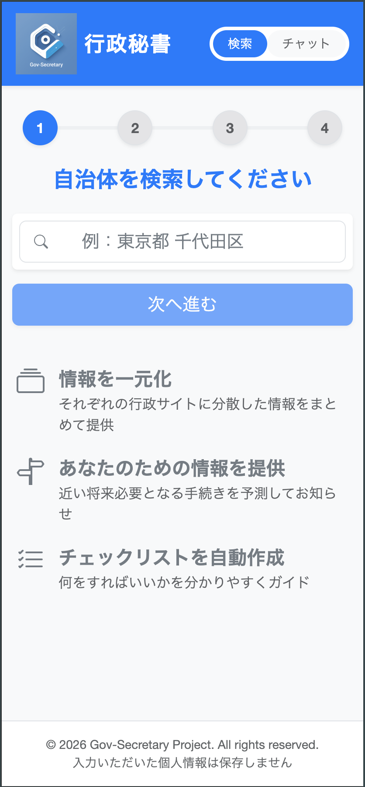


カテゴリの選択画面では、各種補助・手続き情報の必要性が増す「引越し」と「子育て」カテゴリのほか、特にカテゴリを指定しない「探索」も選択肢に含めています。
探索カテゴリでは「すぐに制度情報が必要ではない」「転居を検討している地域にはどのような制度があるか幅広く知りたい」といった場面での利用を想定しています。

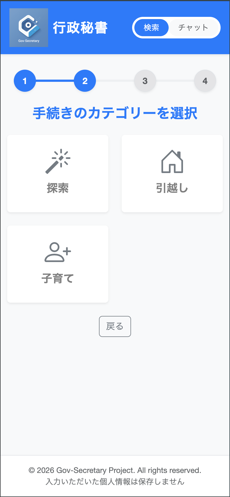


ユーザ情報の入力画面では、制度の検索に用いる基本情報やライフイベント情報を入力できます。
ただし、あくまでユーザ情報の入力は検索精度を向上させるためのオプションであり、提供したくない情報は入力せずとも制度を探すことができます。
また、気軽に使えるように入力されたユーザの情報は保存しない仕様としています。
過去の検索履歴を再参照できない点や制度のブックマークができないデメリットはあるものの、後述するPDFダウンロード機能でカバーしています。

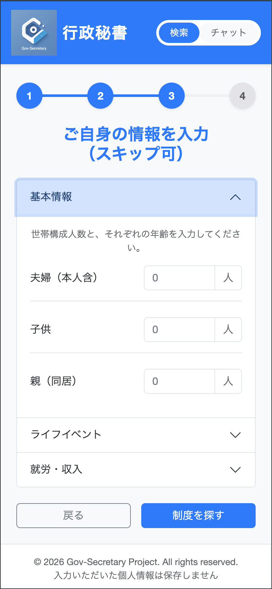


4ステップ目で入力情報をもとに制度情報を表示します。
タイトル、概要に加えて手続きの流れを整理した情報を1制度1枚のカードとして表示しています。
さらに、ハルシネーションによる誤情報の提供リスク防止や、実際に手続きを始める際の経路として、根拠となるURLを提供しています。
また、内容を見返したい情報は再検索の必要がないように、表示情報をPDFにダウンロードできます。

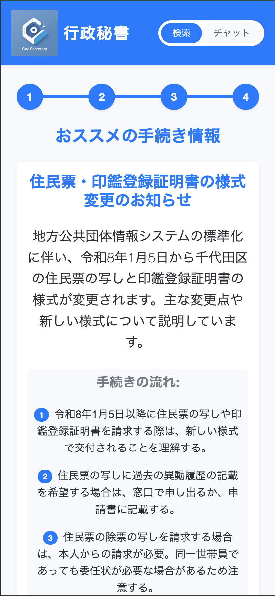


## 3.2. チャットモードUI

チャットモードは右上のタブから切り替えることができ、エージェントとの対話でユーザの要望や情報を伝え、関連しうる制度を検索・表示します。
なお、検索モードと同様に入力情報は保存しません。
ユーザの意図が一定以上読み取れると、関連制度を5件ずつ表示します。

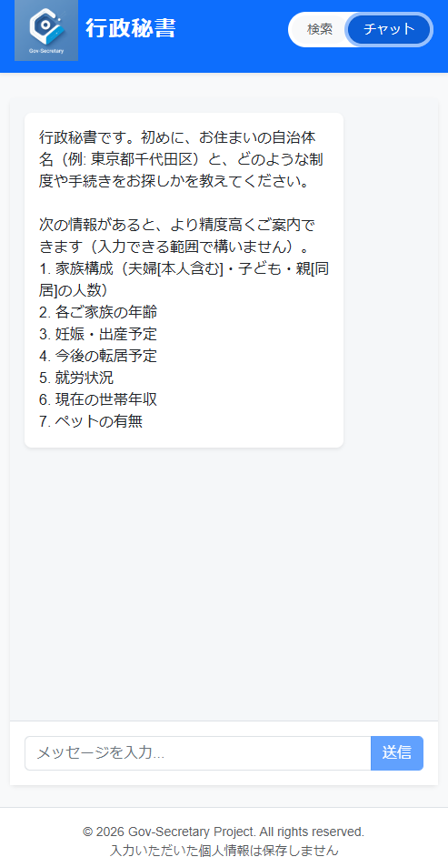


候補が表示されると「詳細を開く」ボタンを押すことで詳細な制度の説明と手続き手順、根拠となるURLを確認することができます。
検索モードと同様に制度情報をPDFでダウンロードすることもできます。

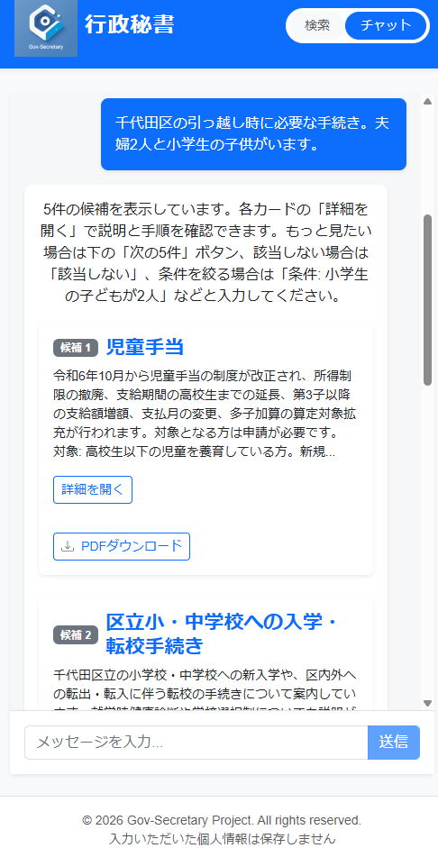 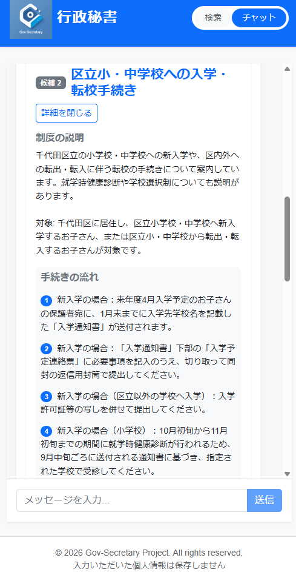


「次の5件」ボタンを押すと、マッチした制度の中から次の5件を表示します。
さらに、制度表示後はいつでもユーザ情報や知りたい制度のカテゴリを追加で送信することができ、検索・表示される制度も情報に応じて更新されます。

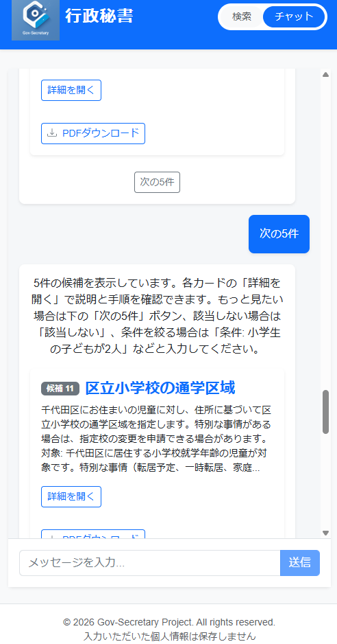 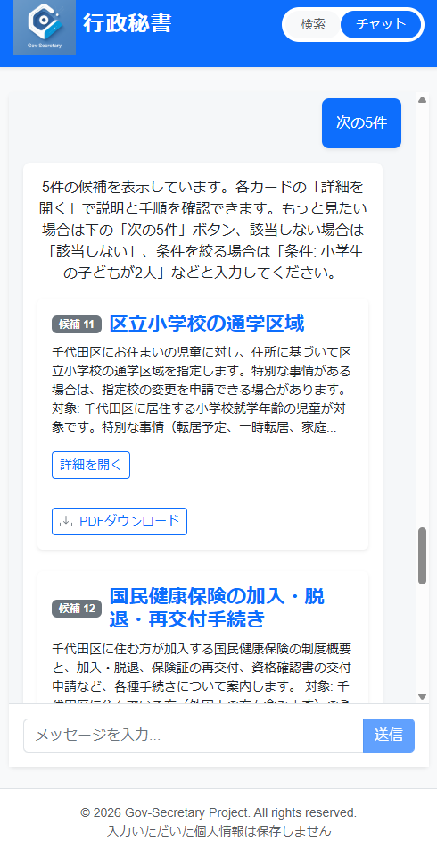


## 3.3. 制度情報データベース
行政秘書ではより速い応答で正確な情報をわかりやすく整理して提供するため、あらかじめ制度情報データベースを構築しています。
データベースは定期的なバッチ処理で構築されており、新しい制度の追加や古い制度の廃止があっても、常にユーザが最新の情報を参照できるように更新しています。
現時点では一部の限られた自治体のみデータベースを構築していますが、DataStoreを追加構築するだけで新たな自治体に拡張することも容易です。

バッチ処理では主に制度情報検索と情報構造化を行っています。

### 3.3.1. 制度情報検索
制度情報検索では、各自治体のウェブページから制度、手続き、届出等の情報を検索し、制度候補のURLリストを生成します。
検索は自治体ウェブページを登録したDataStoreとVertex AI Searchを利用することで、正確な情報のみを抽出しています。
また、収集したURLリストは重複を排除することで、同じ制度が複数のカードで表示されないよう制御しています。

### 3.3.2. 情報構造化
情報構造化では、収集したURLリストの内容から制度情報、適用条件、手続きの流れ、申請に必要な書類等を抽出し構造化します。
各URLから取得した内容をGeminiで情報抽出・構造化し、制度情報のデータを作成します。
作成したデータをFirestoreに格納することで、自治体ごとに制度情報データベースを作成しています。
以下は構造化された制度データの一例です。

```json
{
  "domain": "childcare",
  "eligibility_profile": {
    "applicable_employment": null,
    "child_age_max": null,
    "child_age_min": 0,
    "child_count_max": null,
    "child_count_min": 1,
    "household_size_max": null,
    "household_size_min": null,
    "income_max": null,
    "income_min": null,
    "is_mandatory": false,
    "requires_children": true,
    "requires_disability_child": null,
    "requires_moving": null,
    "requires_pregnancy": true,
    "requires_single_parent": null,
    "eligibility_text": "令和6年度までに妊娠・出産等された方で、妊娠届出後にままぱぱ面談（妊婦面談）を受けた妊婦、または出産後に保健師などによる赤ちゃん訪問（乳児家庭訪問）を受けた養育者。申請日時点で千代田区に住民票があること。他区市町村で同様のギフト支給を受けていないこと。流産・死産された方も対象となる場合があります。"
  },
  "importance": "medium",
  "kind": "voucher_coupon",
  "life_event_tags": [
    "pregnancy",
    "birth",
    "newborn"
  ],
  "municipality_id": "tokyo-chiyoda",
  "need_prevalence_score": 80,
  "official_urls": [
    "https://www.city.chiyoda.lg.jp/koho/kosodate/kosodate/ninshin/shussan-kosodate-oenjigyo.html"
  ],
  "required_info": [
    "申請書",
    "本人確認書類"
  ],
  "source": {
    "retrieved_at": "2026年2月15日 21:11:57.610 UTC+9",
    "source_title": "出産・子育て応援事業（令和6年度までに妊娠・出産された方向け）"
  },
  "steps": [
    "妊娠届出後にままぱぱ面談（妊婦面談）を受ける",
    "出産後に保健師などによる赤ちゃん訪問（乳児家庭訪問）を受ける",
    "対象者には申請方法が案内される",
    "申請書を提出する",
    "ギフトカードが送付される",
    "ギフトカードを初回登録する"
  ],
  "summary": "千代田区が妊娠期から子育て期にわたる切れ目ない支援として、伴走型相談支援と経済的支援を一体的に行う事業です。令和6年度までに妊娠・出産された方を対象に、面談後に育児用品などに使えるギフトカードを支給します。",
  "title_common": "出産・子育て応援ギフト（令和6年度まで）",
  "title_official": "出産・子育て応援事業（令和6年度までに妊娠・出産された方向け）"
}
```


## 3.4. 制度の検索とランキング
ユーザ入力情報から推測したユーザプロファイルをもとに制度情報データベースから適用可能性がある制度情報を取得し、制度ごとに必要度のスコアを計算しユーザに表示しています。
この時、入力された自治体に紐づく親自治体 (例えば千代田区であれば東京都、横浜市であれば神奈川県) の制度も同時に検索してまとめてスコアリングすることで、分散している情報を一度に検索することができます。
スコアはデータベース構築時にGeminiで付与した「制度の重要度」や「制度を必要としている人の割合」と、ユーザ入力から推定したカテゴリ、ライフイベントの一致度、適用有無から計算しています。
将来的にはチャットモードで入力された文章を使ったベクトル検索の追加も検討しています。


## 3.5. アーキテクチャ
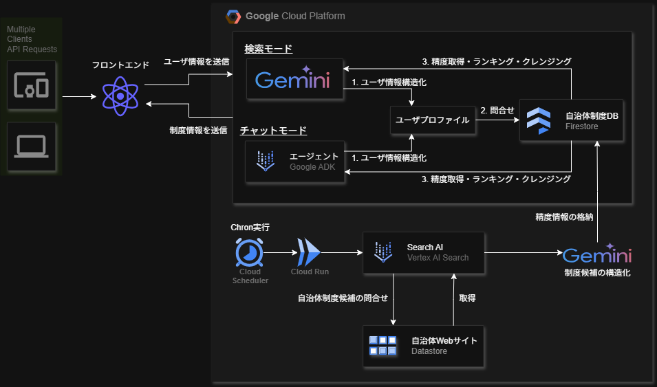

- フロントエンド
	- React + Viteで構築
	- CSSフレームワークはBootstrapを採用
	- CloudFlareでデプロイ
- バックエンド (制度情報の送信)
	- Google ADKでマルチエージェントベースのチャットモードを構築
- バックエンド (データベース構築)
	- Cloud Schedulerを利用して定期実行
	- 制度検索にはDataStoreとVertex AI Searchを利用
	- 情報の構造化にGeminiを活用
	- データベースにはFirestoreを採用
<br><br>

# 4. 結びに
作成チームの身近な人に試していただきました。<br>
- Mさん
    - （Good）第一印象として青ベースの色調が綺麗で、清潔感・安心感がある
    - （Good）引越しや子育てなどのアイコンがわかりやすい。指示された入力欄で迷うところや面倒なところがほぼなかった
    - （改善点）保育園手続きだけでなく、学童・幼稚園・シッターの情報も子連れ引越しの面では欲しいところ
        - （改善方法）データベースの拡張に伴い対処可能
- Kさん：
    - （Good）概要がパッと見でわかりやすく、手順も細かくは読んでいないものの短くまとまっていて良い
    - （Good）参照元のリンク表示がわかりやすく、タップした際に別タブとして開くこともあり、まとまった情報と詳細な情報を行き来できるところに安心感がある
    - （改善点）いつまでにやるべき内容なのか、ライフイベントの時系列順序に並んでいると嬉しい
        - （改善方法）データベース内のライフイベントに時期を考慮した順序付けを行うことで対処可能

頂いたフィードバックから本サービスの趣旨である「知らない」「見つからない」「わからない」を解消し機会損失を防ぐという目標に対して貢献できていると考えています。
情報の網羅性やレコメンドの性能等の要素技術をさらに向上させることで、より多くの人々や自治体の抱える課題を解決する便利なサービスにできると確信しています。

# 5. 出典
[東京ゼロエミ住宅普及促進事業](https://www.support-navi.metro.tokyo.lg.jp/detail/1/YLQtXnEC7E9UATrib)<br>
[無痛分娩費用の助成](https://www.support-navi.metro.tokyo.lg.jp/detail/1/4mDRB9O6sVfb4lLDe)<br>